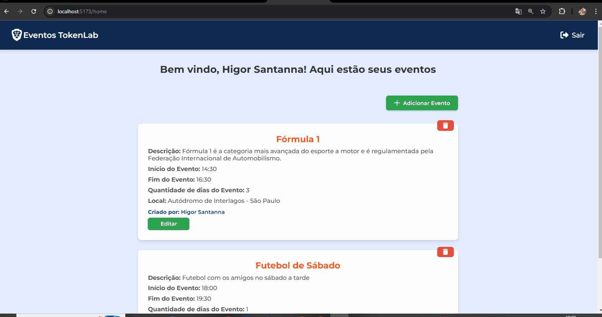
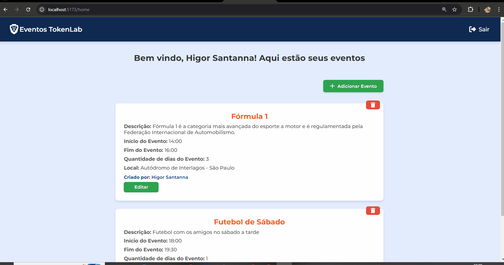

[JAVASCRIPT__BADGE]: https://img.shields.io/badge/Javascript-000?style=for-the-badge&logo=javascript
[NODE__BADGE]: https://cdn4.iconfinder.com/data/icons/logos-3/454/nodejs-new-pantone-white-512.png
[PROJECT__BADGE]: https://img.shields.io/badge/📱Visit_this_project-000?style=for-the-badge&logo=project
[PROJECT__URL]: https://github.com/Fernanda-Kipper/Readme-Templates

<h1 align="center" style="font-weight: bold;">Gerenciador / Calendário de eventos 💻</h1>

<p align="center">
 <a href="#about">Sobre</a> • 
 <a href="#images">Funcionamento</a> • 
  <a href="#install">Instalação</a>
</p>

<h2 id="started">📌 Sobre</h2>

O projeto foi desenvolvido com a linguagem TypeScript. O backend foi desenvolvido em NODE, com o framework Fastify, Prisma sendo o ORM e com o banco de dados sendo o MongoDB. Já o seu Frontend foi desenvolvido em ReactJS + Vite, utilizado Axios para o consumo da API e Styled Components para a estilização.

<h2 id="started">📌 Funcionalidades</h2>

- Adição de eventos;
- Listagem de eventos;
- Atualização de eventos que já existem;
- Remoção de eventos;
- Login;
- Cadastro de usuário;
- Responsividade

Cada evento possui um nome, descrição, quantidades de dias que ocorrerá, horário de início, horário de término e local do evento.Além destas funcionalidades é possível ver quem foram os criadores de cada evento.

<h2 id="images">📍 Funcionamento</h2>

<p align="center">
    
</p>

<p align="center">
    
</p>

<p align="center">
    
</p>

<h2 id="started">🚀 Instalação</h2>

O projeto foi feito com a versão 20 do NODE, por isso, certifique a versão do seu NODE para que não haja bugs.
Os exemplos de instalação serão feitos com NPM porém você pode usar o pnpm ou yarn.

<h3>Clonando</h3>

```bash
git clone https://github.com/Higor-Santanna/gerenciador-de-eventos.git
```

<h3>Frontend</h3>

Entre na pasta de frontend, abra o terminal e digite o comando para instalar todas as dependências:

```bash
npm install
```
Para rodar a aplicação frontend, no seu terminal digite o seguinte comando e clique o link que aparecer:

```bash
npm run dev
```

<h3>Backend</h3>

Entre na pasta de backend, abra o terminal e digite o comando para instalar todas as dependências:

```bash
npm install
```
Como esse projeto foi desenvolvido com MONGO Db, será necessário você ter uma conta no atlas. Para pegar sua URL do banco de dados basta criar um novo projeto -> clicar no nome do projeto que você acabou de criar -> clicar em connect -> clicar em Drivers -> selecionar o NODE, copiar o link do banco de dados -> Colar esse link no DATABASE_URL que está no arquivo .env.

Não se esqueça de instalar o mongo db no seu projeto.

Após feito esse conexão basta digitar o comando abaixo e seu backend jpa está no funcionando.

```bash
npm run dev
```